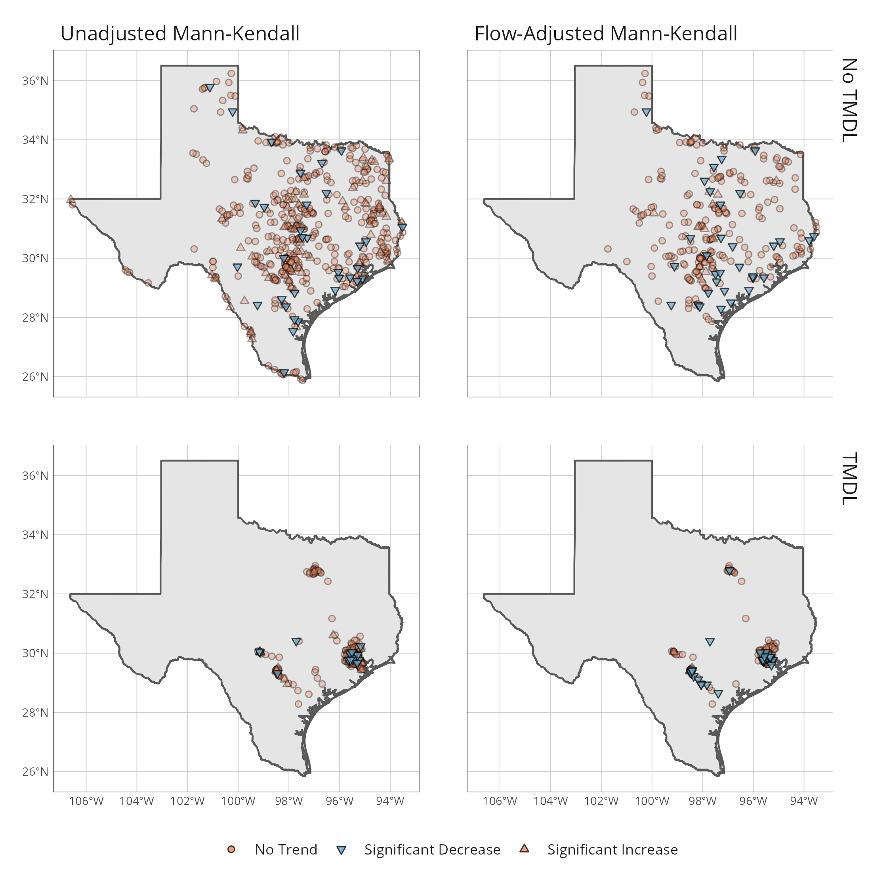

```{r setup, 	echo=FALSE, message=FALSE, warning=FALSE}
library(drake)
library(forcats)
library(texreg)
library(officedown)
library(officer)
library(flextable)

options(tinytex.verbose = TRUE)
options(knitr.kable.NA = '')
opts_chunk$set(echo = FALSE, tab.lp="tab:", fig.lp="fig:")

```

**Research Implications**

  * Despite substantial efforts, there are low rates of decreasing *Escherichia coli* concentrations across Texas freshwater streams.
  * We observed no evidence of differences in the probability of water quality improvements between streams with and without Total Maximum Daily Loads.
  * More work is needed to identify commonalities in successful planning efforts in the state.
  * New risk assessment frameworks are available for the state to prioritize and focus resources on streams with the highest human health risks.

# Introduction {.unnumbered}

Elevated fecal indicator bacteria (FIB) concentrations are responsible for approximately 40 percent of water quality impairments in the state of Texas [@texas_commission_on_environmental_quality_executive_2018]. *Escherichia coli* (*E. coli*) and Enterococci are non-host specific bacteria typically present in the gut of warm-blooded animals and utilized as FIB to indicate the potential for recent fecal contamination of water bodies. *E. coli* and Enterococci concentrations are evaluated using a numeric criteria based on U.S. Environmental Protection Agency (EPA) studies correlating increased incidences of gastrointestinal illnesses with increasing concentrations of *E. coli* or Enterococci at recreational beaches with known point source sewage discharges [@dufour_bacterial_1984; @fujioka_us_2015]. Potential FIB sources include sewage, domestic livestock, wildlife, and pets; furthermore, sediments and algal communities can harbor and potentially allow *E. coli* to naturalize in the environment [@ishii_escherichia_2008].

Federal, state, and local government agencies and stakeholders have devoted substantial resources to address these impairments. Through July 2018, the Texas Commission on Environmental Quality (TCEQ) has developed and approved 187 Total Maximum Daily Loads (TMDLs) that define the FIB load allocations for water bodies not meeting state water quality standards. In addition to TMDL development, TCEQ and the Texas State Soil and Water Conservation Board provided funding and support for the development of 34 accepted watershed-based plans by local stakeholders through July 2018. From 1998 through 2015, the U.S. Department of Agriculture issued over $171 million in cost-share payments to Texas agricultural producers for best management practices that improve or protect water quality [@environmental_working_group_ewgs_2016]. Local and regional governmental entities are also working to address non-point source driven impairments through updated codes and design guidance that promote low impact development. Notable examples include green storm water infrastructure design criteria adopted in Harris County, low impact design guidance from the San Antonio River Authority, and the City of Austin's watershed protection ordinance among others [@dorman_san_2013; @storey_harris_2011; @kip_impact_2016].  

Achieving in-stream FIB reductions is challenging because of strong influences of land cover on FIB concentrations and the wide diversity of potential point and non-point indicator bacteria sources amongst watersheds [@smith_assessment_2004; @mallin_comparative_2009]. Observed improvements in non-point source degraded water quality are hindered by water quality response lag times, shifts in climate and streamflow that obscure impacts of improved land management practices, changes in land use and land cover, and the difficulty in translating site-scale runoff and pollutant reductions to watershed-scale water quality improvements [@meals_lag_2010; @tomer_challenge_2011]. 

TMDLs and watershed-based plans are the two primary tools available to the State of Texas for addressing water quality impairments, with TMDLs being most common. TMDLs identify the total pollutant load that a water body can assimilate and still meet water quality standards. TMDLs also assigns portions of the pollutant load to point and non-point sources. Alongside a TMDL, an Implementation Plan (I-Plan) is developed using stakeholder input to identify how TMDL allocations will be achieved. Historically, TMDLs were treated as desktop modelling exercises and generally considered well suited for point-source driven impairments that can be easily modeled as steady-state systems [@haith_systems_2003]. However, there are concerns about the effectiveness of the approach for non-point source dominated systems, especially in watersheds dominated by un-regulated agriculture.

One indication that collective efforts are beginning to work is a decrease in the number of FIB impaired water bodies from 320 segments in 2010 to 237 segments in 2018 [@texas_commission_on_environmental_quality_executive_2018]. While water body de-listings are one metric of improvement, further insight can be gleaned to provide appropriate context of the relative impacts (or lack of impacts) from TMDLs. For example, a water body that is orders of magnitude above the standard may see significant water quality improvement but remain on the list of impaired water bodies. Conversely an unimpaired water body may see undesired increases in bacteria loads but not enough to trigger an impairment listing. Furthermore, the number of listings is a flawed metric due to administrative reasons for removal such as changes in water body classification (lengthening or shortening of the assessed water body) or changes in water quality criteria.

With nearly 200 completed TMDLs addressing bacteria impairments in the State of Texas, there is an opportunity to assess the effectiveness of TMDLs in achieving detectable water quality improvements. Trends in water quality can be masked by natural variation in precipitation and discharge because of the correlation between pollutant concentrations and flow. Therefore, flow-adjustment methods can provide insight into if pollutant concentration trends are driven primarily by changes in streamflow or on the ground practices [@helsel_statistical_2002; @stow_assessing_2003]. This study intends to (1) describe actual and flow-adjusted indicator bacteria trends across the state, and (2) assess the effect of TMDLs on indicator bacteria trends. 


# Methods {.unnumbered} 

## Data {.unnumbered}

TCEQ Surface Water Quality Monitoring (SWQM) stations and associated *E. coli* monitoring data were obtained from the Water Quality Portal (https://www.waterqualitydata.us/) using the "dataRetrieval" package in R version 3.6.2 [@CRAN:dataRetrieval; @CRAN:base]. Data were retrieved for all stations over a 7-year period between January 1, 2012 through December 31, 2018. A 7-year period was chosen because it aligns with the assessment period length used to evaluate compliance with water quality criteria. Apriori power analysis by Monte Carlo simulation of *E. coli* data sets at median variance indicated that the modified Mann-Kendall test has a power of 0.63 to detect a 40% change in concentration over 7 years with 3 samples per year and *α* = 0.10 [@schramm_estimating_2021]. Statistical power increased to 0.79 with 4 samples per year. In order to maximize sample size and in consideration of within site variation of annual sampling effort we retained stations with a median three or more samples per year for analysis. The actual statistical power of of the modified Mann-Kendall test at an individual station will vary based on the number of samples and sample variance at that station.

Mean daily streamflow data from USGS stream gages were downloaded from the National Water Information System using the dataRetrieval package in R. TCEQ SWQM stations were linked to the nearest upstream or downstream USGS streamflow gage using the NHDPlus National Seamless database [@moore2016] and the "nhdplusTools" package in R [@CRAN:nhdplusTools]. SWQM monitoring stations and data without a stream gage within 2 km on the same stream were removed from analysis. Since we assessed *E. coli* concentrations and not loads, co-located streamflow data were not necessary. The 2 km threshold was deemed adequate to capture streamflow variation for flow-adjustment procedures based on visual inspection of gages and stations in an attempt to balance maximizing stations with streamflow data and accurate streamflow data.

The location of water bodies with FIB TMDLs was obtained from the TCEQ [@tceq_list_2020]. Water body locations and TMDL classification were spatially linked to the NHDPlus database and SWQM station data set to classify SWQM stations as located within or outside a TMDL water body. TMDL location data is also available from the EPA Assessment, TMDL Tracking and Implementation System (ATTAINS) database (https://www.epa.gov/waterdata/attains). However, upon inspection of Texas specific ATTAINS data, a large number of FIB TMDLs were missing and the decision was made to utilize TMDL data directly from TCEQ.

## Trend Analysis {.unnumbered}

We assessed the presence of upward or downward monotonic trends in log-transformed *E. coli* concentrations using the modified Mann-Kendall test and Sen slope at each station [@yue_regional_2002; @helsel_statistical_2002]. The Mann-Kendall test is a non parametric two-sided test, with trends considered upward or downward based on the value of the Sen Slope with a predetermined *α* of 0.1. Typically, substantial variance in *E. coli* concentration can be explained by natural changes in stream discharge, precipitation, and hydrology. However, decision-makers are more often concerned with human influence on changes in *E. coli* concentration. The modified Mann-Kendall test for trend can be adjusted to account for variation in streamflow by applying the test to the regression residuals between streamflow and *E. coli* concentration [@helsel_statistical_2002]. Residuals were obtained from a Generalized Additive Model (GAM) of form:

$$
log(y) = \beta_0 + tp_1(log(x)) + \varepsilon
$$


where *y* is *E. coli* concentration,  *β~0~* is the intercept, *x* is streamflow, and *ε* is the error term assumed to be normally distributed around mean zero. *tp~1~* is a smoothing function that utilizes reduced rank versions of thin plate splines [@wood_2003]. GAMs were fit using the "mgcv" package in R which utilizes generalized cross validation to estimate the optimal splines in the smoothing function [@wood_2011]. While GAMs are increasingly used for water quality assessment and trend detection our primary interest was to obtain the residuals from the model and assess the likelihood of a monotonic improvement in flow-adjusted *E. coli* concentrations across a wide number of sites [@beck_numerical_2017; @murphy_generalized_2019].

## Relationship between TMDLs and FIB Trends {.unnumbered}

Presence of significantly decreased *E. coli* concentration was modeled as a dichotomous outcome using generalized linear model (GLM) logistic regression. GLMs were developed in R with the "glm" function using the binomial distribution and logit link. The binary response, "improvement" (significantly decreasing *E. coli* trend) or "no improvement" (no trend or positive trend) was modeled as a function of the presence or absence of a TMDL:

$$
logit(P) =\beta_0 + \beta_1tmdl
$$


The dependent variable was coded as zero if the Sen slope was positive or Mann-Kendall test p-value ≥ 0.1 or one if the Sen slope was negative and Mann-Kendall test p-value < 0.1. *P* is the probability of significant improving trend, *β~0~* is the intercept, *β~1~* is the regression coefficient, and *tmdl* is a categorical variable indicating absence (*tmdl* = 0) or presence (*tmdl* = 1) of a TMDL. The equation can also be interpreted as the log-odds of water quality improvement is equal to *β~0~* in absence of a TMDL and the log-odds of water quality improvement is equal to *β~0~* plus *β~1~* in the presence of a TMDL. Since log-odds are generally not intuitive to understand, we report the outcome as probability (*P*) of water quality improvement, calculated as:

$$
P = \frac{1}{1+e^{-logit(P)}}
$$


# Results {.unnumbered} 

A total of 778 SWQM stations were included in the unadjusted analysis, with 224 SWQM stations included in a TMDL (Table \@ref(tab:sumvariables)). The station sample size decreased drastically for the flow-adjusted analysis due to fewer stations located proximate to a USGS stream gage. On average, the number of sampling events at SWQM stations with TMDLs are higher than SWQM station without a TMDL. The *E. coli* geometric mean concentrations at SWQM stations with a TMDL are on average higher than SWQM stations without a TMDL.


## Trend Analysis {.unnumbered} 

The modified Mann-Kendall test indicated significantly decreasing *E. coli* concentration at 6.3% of the 778 SWQM stations. Of the 244 stations with a TMDL, 6.6% showed significant decreases in *E. coli* concentrations (Figures \@ref(fig:slopecumedist), \@ref(fig:slopespatdist)). Meanwhile, 6.2% of stations without a TMDL showed significant decreases in *E. coli* concentration. Significant decreases in flow-adjusted *E. coli* concentrations occurred at 13.5% of the 223 assessed SWQM stations. Significant decreases in flow-adjusted *E. coli* concentrations were observed at 16.9% of 77 SWQM stations with a TMDL and 11.6% of 146 SWQM stations without a TMDL.

For SWQM stations, both with a TMDL and without a TMDL, a higher proportion of stations showed significant decreases in *E. coli* concentration when the modified Mann-Kendall test was adjusted for flow (Figure \@ref(fig:slopecumedist)). This difference suggests that local changes in streamflow may have masked improvements in *E. coli* concentration. A single-sided paired t-test on the unadjusted and flow-adjusted slopes at each SWQM station suggests a decrease in mean slope for flow-adjusted values (*t* = -7.05, *df* = 222, *p*-value < 0.01). Figure \@ref(fig:slopespatdist) indicates that when the flow-adjustment procedure is applied, some individual stations shifted from significant decreases in *E. coli* concentration to no detectable trend. This indicates individual sites will vary from the state-level (population) trend reflected by the percentage change and paired t-test result. However, the result highlights the importance of the flow-adjustment procedure when evaluating water quality constituent trends.


## Relationship between TMDLs and FIB Trends {.unnumbered} 

There is no evidence that TMDLs are predictive of significantly improved *E. coli* concentrations (GLM, *p* = 0.841, Table \@ref(tab:modsum1)). The point probability estimates are 0.067 and 0.062 for TMDL and non-TMDL stations, respectively, with overlapping 95% confidence intervals indicating a significant decrease in *E. coli* concentration was as likely to occur at a non-TMDL station as a TMDL station (Figure \@ref(fig:pointestimate)). 

Similar results are observed in the flow-adjusted models where GLM indicated TMDLs alone are not predictive of decreases in flow-adjusted *E. coli* concentrations (*p* = 0.278, Table \@ref(tab:modsum1)). The flow-adjusted point probability estimates are 0.169 and 0.116 for TMDL and non-TMDL stations with overlapping 95% confidence intervals, again indicating significant decreasing trends were as likely to occur at non-TMDL stations and TMDL stations (Figure \@ref(fig:pointestimate)).


# Discussion {.unnumbered}

This works provides an initial analysis of the effectiveness of TMDLs within Texas for addressing FIB impairments. We demonstrate that there are low rates of decreased *E. coli* concentrations and that water bodies with TMDLs have no discernible difference in rates of improvement from water bodies without a TMDL. Flow adjustment procedures indicate that changes in flow masked some improvements in *E. coli* concentrations over the sampled time period. Low rates of decreasing *E. coli* concentrations were anticipated for non-TMDL stations since the stations either have low ambient concentrations of *E. coli* or are unlikely to have practices that address local sources of *E. coli*. The low rates of measurable improvements in *E. coli* concentrations within TMDL watersheds are not entirely unexpected. First, there is considerable variation in background and anthropogenic *E. coli* sources within a watershed. Second, TMDLs and I-Plans are not always the appropriate planning mechanism to successfully address non-point source dominant pollutants such as *E. coli*. Third, the data to parse out the characteristics of successful TMDL implementation is not available.

From a source and risk assessment perspective, there can be considerable variation in the sources of *E. coli* in a watershed. Indicator bacteria concentrations are well predicted by land use and stream order [@mallin_comparative_2009; @didonato_effects_2009; @rafi_escherichia_2018]. However, high levels of imperviousness may be difficult or impossible to mitigate. Similarly, substantial contributions from wildlife in low order unimpacted watersheds may be challenging or undesirable to mitigate. This regional population level study does not parse out the possible background-level *E. coli* conditions or the feasibility of reducing *E. coli* concentrations at individual sites. Furthermore, TMDLs within Texas currently do not utilize microbial source tracking (MST) to parse out potential contributors and sources of FIB within TMDLs.

Considerable efforts have been made to quantify the risks associated with FIB and integrate findings in watershed decision-making. Using FIB to assess human health risk in freshwater streams presents certain challenges. FIB can survive outside of the host and become naturalized in the environment effectively increasing baseline concentrations [@ishii_escherichia_2008]. Furthermore, these FIB are not always host specific and may overestimate the risk relative to FIB originating from human sources, such as raw sewage, bather shedding, or treated effluent. The ability and desire to manage or mitigate non-human sources such as wildlife can be costly with uncertain effectiveness and limited impact on reducing potential risk for human health. 

MST and Quantitative Microbial Risk Assessment (QMRA) are potential cost-effective frameworks that are increasingly recommended to assist resource managers with management practice selection and translation of FIB concentrations into human health risk [@goodwin_consideration_2017; @us_environmental_protection_agency_office_of_water_overview_2014]. QMRA studies have consistently indicated that FIB from non-human and non-cattle sources likely result in a lower risk for a GI infection and illness than from FIB resulting from human sources [@soller_estimated_2010; @schoen_assessing_2010; @gitter_human_2020]. The presence of fecal pathogens in streams, as indicated by monitoring the FIB concentrations, can be influenced by pathogen source. A management approach that relies solely on the concentration of FIB and not the contributing sources can potentially mischaracterize the human health risk associated with recreation in a specific water body. The use of MST and QMRA provides an opportunity to focus TMDL planning efforts on streams with high human health risk and addressable FIB sources. 

Water quality planning efforts vary in scope and scale related to financial resources invested, stakeholder engagement, leadership, and progress tracking. Although we found that TMDLs did not result in improved water quality outcomes, the literature indicates that collaborative watershed management can lead to improved water quality [@scott_does_2015; @scott_is_2016]. Instituting a truly collaborative watershed management effort is a challenge due to institutional silos, stakeholder perceptions, resource availability, and presence of cooperative networks [@lubell_collaborative_2004; @imperial_using_2005; @koontz_planning_2014]. Agriculturally dominated watersheds, common in Texas, present additional challenges for water quality planning. Reductions in non-point source pollutant from agriculture are often needed to meet TMDLs and other water quality goals. However, voluntary implementation of best management practices faces major barriers in the form of economic investments required of landowners, trust in government programs and initiatives [@jordan_tmdl_2011; @kay_quantification_2008; @guo_what_2019]. Partially in response to these challenges, the EPA developed guidance for the development of watershed-based plans as a local stakeholder-driven option to identify and address water quality concerns [@us_environmental_protection_agency_quik_2013]. 

Under the  watershed-based plan concept, local stakeholders drive the identification of issues and desired outcomes increasing the likelihood of engagement, implementation, and successful outcomes [@koontz_planning_2014]. Agencies that lead these collaborative planning efforts often face difficulties shedding institutional and bureaucratic norms and enabling the flexibility required for successful collaborative governance regimes [@biddle_improving_2017]. However, agencies can also add administrative capacity, financial and technical resources, and compel participation that may lead to improved outcomes [@biddle_improving_2017; @bitterman_modeling_2020]. 

## Limitations {.unnumbered}

The modified Mann-Kendall test on *E. coli* data has limited power to detect trends in *E. coli* data sets at typical monitoring frequencies [@schramm_estimating_2021]. For a station with a median population variance of *E. coli* concentration, monthly sampling is required to obtain 0.71 power for detecting a 20% change in *E. coli* concentration. Monthly sampling is the best case scenario for most stations. Quarterly sampling is a more typical scenario for stations across the state. At four samples annually, a 40% change in *E. coli* concentration is required to achieve approximately the same power. The number of stations with adequate data limits exploratory analytic approaches. For unadjusted *E. coli* trends, 107 of the 157 stream segments with FIB TMDLS were included in the analysis. However, for flow-adjusted *E. coli* trends, only 32 of 157 stream segments with FIB TMDLs were included in the analysis. SWQM stations lacking a proximate stream gage, without adequate data samples, or with only Enterococci data were excluded from analysis. This sample size restricts extending the logistic regression model to include additional explanatory covariates such as land-use, implementation funding, and spatial dependencies that could provide desired insight. The number of SWQM stations throughout the state without a proximate stream gage severely restricted sample size. Future work may consider the use of proxies for streamflow such as precipitation which have substantial effect on pollutant loading and possibly allow the inclusion of more SWQM stations [@sinha_precipitation_2016]. While further insights could also be gleaned by assessing financial resources invested, the types of projects implemented, and stakeholder involvement following TMDL development [@scott_does_2015; @scott_is_2016], this data is not readily available across the study area.


# Conclusions {.unnumbered}

Our analysis indicates limited success at reducing *E. coli* bacteria concentrations following development of TMDLs in Texas.  While the state's TMDL and I-Plan efforts do fulfill federal regulatory requirements, the lack of positive environmental outcomes suggests further work is needed to identify locally successful planning mechanisms and build upon those efforts. It is likely the TMDL planning processes have evolved over time and space as response to administrative changes, stakeholder feedback, and capacity of local stakeholders to lead efforts. In-depth assessment of the processes would provide valuable insight when attempting to link outcomes to process. This study highlights the importance of a robust monitoring to assess program effectiveness and linkages to environmental outcomes; especially in light of continued efforts to develop additional TMDLs to address other impaired streams.


**Data Availability Statement**
Data and code generated or used during the study are available online at https://doi.org/10.5281/zenodo.4321729.

**Acknowledgements** - We thank Shubham Jain and Stephanie DeVilleneuve for comments on a draft of the manuscript.

**Author Bio and Contact Info**

Michael Schramm (corresponding author) is a research specialist for the Texas A\&M AgriLife, Texas Water Resources Institute.He provides modeling, data science, and data visualization support for the Institute's watershed planning and assessment program. He can be contacted at michael.schramm@ag.tamu.edu or 578 John Kimbrough Blvd., 2118 TAMU, College Station, Texas 77843-2260.

Dr. Anna Gitter is a post-doctoral research fellow at University of Texas Health Science Center at Houston School of Public Health. Her research is focused on the human health impacts of water quality and she specializes in quantitative microbial risk assessment. She can be contacted at anna.gitter@uth.tmc.edu.

Dr. Lucas Gregory is associate director of Texas A\&M AgriLife, Texas Water Resources Institute. His research interests include: bacteria fate and transport in aquatic and soil environments, watershed assessment, planning and management, watershed assessment tool application and development, water quality monitoring, efficient water resource utilization, implications of water policy on local watershed decision making, and water and human health interactions. Dr. Gregory can be reached at 578 John Kimbrough Blvd., College Station, TX 77843 or LFGregory@ag.tamu.edu.

# References {.unnumbered}

<div id="refs"></div>


# Tables {.unnumbered}
\  

```{r datasum, echo=FALSE, tab.cap='Summary statistics of streamflow and *E. coli* parameters for SWQM stations located on TMDL and non-TMDL water bodies.', tab.id='sumvariables'}

readd(data_summary_table)

```

\  


```{r modsum1, echo=FALSE, tab.cap='Summary of GLM results on unadjusted and flow-adjusted *E. coli* trends. Model coefficents and standard error (in parenthesis) are reported as log-odds.', tab.id='modsum1'}

readd(lr_tables)

```


# Figure Captions {.unnumbered}

```{r slopecumedist, echo=FALSE, fig.cap="Cumulative distribution of Sen slope and associated p-values from the modified Mann-Kendall test on unadjusted and flow-adjusted *E. coli* concentrations at individual monitoring stations.", dpi=300, fig.width=7.48, fig.height=5.61, cap.fp_text=officer::fp_text_lite(bold=FALSE)}

knitr::include_graphics("../figures/fig_2.png", dpi = 300)

```


```{r slopespatdist, echo=FALSE, fig.cap="Map of individual monitoring stations and associated modified Mann-Kendall test results for unadjusted and flow-adjusted *E. coli* concentrations.", dpi=300, fig.width=7.48, fig.height=7.48}

```


```{r pointestimate, echo=FALSE, fig.cap="Probability of significantly reduced *E. coli* concentrations. Points are the estimated point probabilities, lines indicate 95% confidence intervals.", dpi=300, fig.width=5.511811, fig.height=3.740157}

knitr::include_graphics("../figures/fig_4.png", dpi = 300)

```